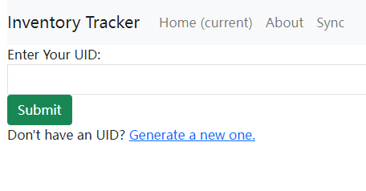
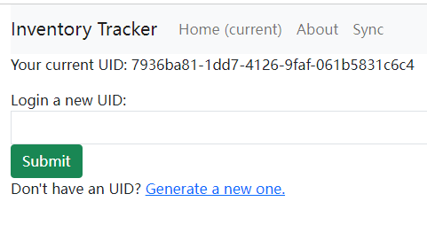
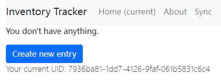
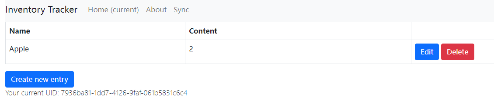

# cs103a-cpa02

This app is an inventory tracker, which tracks all your food, medicine and any other things you have. Never forget any tiny object in your house any more.

## Deployment

1. Install nodejs and npm (depends on platform)
2. Clone this reposityory
```bash
git clone https://github.com/Zeng-Lecheng/cs103a-cpa02.git
```
3. Install required packages.
```bash
npm install
```
4. Run with environment variables.
```bash
PORT=5000 MONGODB_URL=<url of you mongodb server> node app.js
```

## Usage
- Open this app in browser with your domain and port.
- Generate a new UID or submit you old UID
- Navigate to home and add new entries
- Add, edit and delete entries at your wish
- Save UID for futures usage. All devices with the same UID share the same content.

### Screenhots
- First signt of the app



- After generating UID



- Empty inventory



- Inventory with 2 apples



## Videos
- [An video demo](https://drive.google.com/file/d/1sk9UzVyChpZjwwibRNXg-sUk8ue4VJx6/view?usp=sharing)